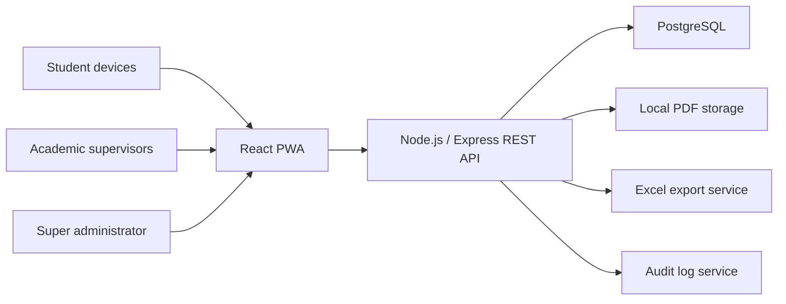

# Complete System Architecture

## Overview

CareApp is a LAN-friendly and internet-deployable PWA. The administrator laptop or hosted server runs the Express API and PostgreSQL database. Student, supervisor, and administrator devices access the React frontend through a browser.

## Runtime Components

- **React PWA frontend:** role-specific screens, responsive UI, service worker, manifest, installable app shell.
- **Express API:** authentication, role authorization, student submission, supervisor review, admin controls, file access, exports.
- **PostgreSQL:** relational source of truth for users, settings, submissions, file metadata, and audit logs.
- **Local file storage:** stores PDF uploads on the server under `server/uploads`; metadata remains in PostgreSQL.
- **JWT authentication:** signed tokens identify `student`, `supervisor`, and `admin` roles.

## Role Flow

1. Student registers with full name, index number, password, and optional supervisor group code.
2. Supervisor registers with full name and password; the system creates a group code.
3. Super administrator accepts or rejects student and supervisor accounts.
4. Supervisor accepts or rejects students assigned to the supervisor group.
5. Accepted students log in and submit one PDF care study during the configured window.
6. Supervisors and administrators can view/download permitted PDFs and export successful submissions to Excel.
7. Login activity, failed attempts, status changes, and submission actions are recorded in audit logs.

## Offline/LAN Behavior

The app shell is installable and cached by the PWA service worker. During examinations, devices still need LAN access to the administrator laptop because authentication, audit logging, and PDF upload require the backend API and PostgreSQL database.
